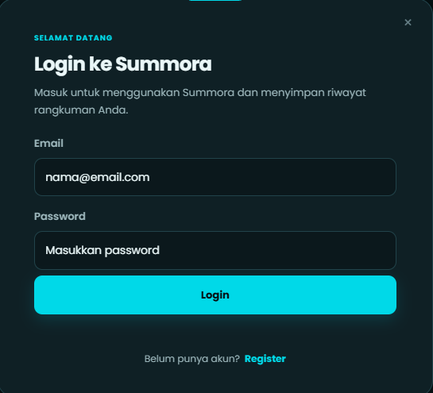
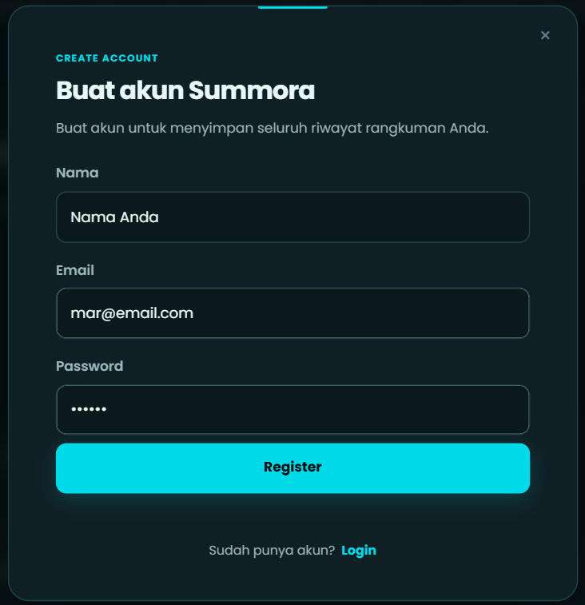
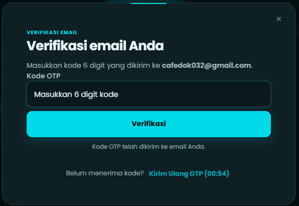

# Summora

Summora adalah aplikasi web yang dibuat untuk membantu merangkum teks panjang menggunakan AI. Pengguna dapat memasukkan teks, mendapatkan inti pembahasan dan poin-poin penting, kemudian menyimpan hasil rangkuman tersebut ke dalam riwayat akun.

Project ini awalnya dibuat sebagai aplikasi sederhana untuk mencoba integrasi AI pada website. Seiring pengembangannya, Summora kemudian dilengkapi dengan sistem akun, session, penyimpanan database, verifikasi email menggunakan OTP, serta pilihan Light Mode dan Dark Mode.

---

## Tentang Summora

Tujuan utama Summora adalah membuat proses memahami teks panjang menjadi lebih sederhana.

Pengguna cukup memasukkan teks yang ingin dirangkum, kemudian sistem akan mengirimkan permintaan ke backend. Backend meneruskan teks tersebut ke OpenRouter untuk diproses oleh model AI. Setelah menerima hasilnya, server memeriksa dan memvalidasi response sebelum menyimpannya ke database.

Hasil rangkuman dibagi menjadi dua bagian:

- Main Idea
- Summary Points

Rangkuman juga diarahkan untuk selalu menggunakan Bahasa Indonesia, termasuk ketika teks yang dimasukkan menggunakan bahasa lain.

---

## Fitur

### Rangkuman Teks

Pengguna dapat memasukkan teks hingga batas yang telah ditentukan pada aplikasi, kemudian menjalankan proses rangkuman menggunakan tombol `Rangkum Teks`.

Hasilnya terdiri dari inti utama teks dan beberapa poin penting.

### Login dan Register

Summora memiliki sistem akun sehingga setiap pengguna mempunyai data dan riwayat rangkumannya sendiri.

Fitur authentication meliputi:

- Register
- Login
- Logout
- Session
- Pemeriksaan status login
- Password hashing menggunakan bcrypt

Password tidak disimpan dalam bentuk plaintext.

### Verifikasi Email

Pada proses register, akun baru harus melewati verifikasi email menggunakan OTP.

OTP yang digunakan memiliki karakteristik:

- 6 digit
- Berlaku selama 5 menit
- Maksimal 5 kali percobaan
- Resend memiliki cooldown 60 detik
- OTP disimpan dalam bentuk hash
- OTP lama digantikan ketika kode baru dikirim

Pengiriman email menggunakan Nodemailer melalui Gmail SMTP dengan Google App Password.

Akun email yang digunakan untuk mengirim OTP:

```text
summora.id@gmail.com
```

### Riwayat Rangkuman

Rangkuman yang berhasil dibuat akan disimpan ke database dan dikaitkan dengan akun pengguna.
Data yang disimpan meliputi:

- ID rangkuman
- User ID
- Teks asli
- Main Idea
- Summary Points
- Waktu pembuatan

Pengguna hanya dapat mengakses riwayat yang dimiliki oleh akunnya sendiri.

## Fitur

### Rangkuman Teks

Pengguna dapat memasukkan teks hingga batas yang telah ditentukan pada aplikasi, kemudian menjalankan proses rangkuman menggunakan tombol `Rangkum Teks`.

Hasilnya terdiri dari inti utama teks dan beberapa poin penting.

### Login dan Register

Summora memiliki sistem akun sehingga setiap pengguna mempunyai data dan riwayat rangkumannya sendiri.

<p align="center">
  
</p>

Fitur authentication meliputi:

- Register
- Login
- Logout
- Session
- Pemeriksaan status login
- Password hashing menggunakan bcrypt

Password tidak disimpan dalam bentuk plaintext.

### Verifikasi Email

Pada proses register, akun baru harus melewati verifikasi email menggunakan OTP.

<p align="center">
  
</p>

OTP yang digunakan memiliki karakteristik:

- 6 digit
- Berlaku selama 5 menit
- Maksimal 5 kali percobaan
- Resend memiliki cooldown 60 detik
- OTP disimpan dalam bentuk hash
- OTP lama digantikan ketika kode baru dikirim

<p align="center">
  
</p>

Pengiriman email menggunakan Nodemailer melalui Gmail SMTP dengan Google App Password.

Akun email yang digunakan untuk mengirim OTP:

```text
summora.id@gmail.com
```
Riwayat Rangkuman

Rangkuman yang berhasil dibuat akan disimpan ke database dan dikaitkan dengan akun pengguna.

Data yang disimpan meliputi:

ID rangkuman
User ID
Teks asli
Main Idea
Summary Points
Waktu pembuatan

Pengguna hanya dapat mengakses riwayat yang dimiliki oleh akunnya sendiri.

Chat pada Rangkuman

Summora juga menyediakan penyimpanan percakapan yang berhubungan dengan rangkuman melalui tabel summary_chats.

Fitur ini digunakan agar percakapan tetap terhubung dengan rangkuman tertentu dan pengguna yang membuatnya.

Light Mode dan Dark Mode

Summora memiliki dua pilihan tampilan:

<p align="center">   </p>
Light Mode
Dark Mode

Perubahan tema hanya memengaruhi tampilan tanpa mengubah fungsi utama aplikasi.

 ## Teknologi yang Digunakan

Summora menggunakan beberapa teknologi yang berbeda untuk menangani frontend, backend, database, AI, authentication, dan pengiriman email.

### Frontend
- HTML
- CSS
- JavaScript

### Backend
- Node.js
- Express.js

### Database
- PostgreSQL

### AI
- OpenRouter API

### Authentication
- Express Session
- bcrypt

### Email
- Nodemailer
- Gmail SMTP
- Google App Password

---

## Cara Menjalankan Project

Bagian ini digunakan jika ingin menjalankan Summora secara lokal.

### 1. Clone repository
Clone repository Summora kemudian masuk ke folder project.

```bash
git clone <repository-url>
cd summora
```
Ganti `<repository-url>` dengan URL repository Summora.

### 2. Install dependency
Setelah masuk ke folder project, jalankan:

```bash
npm install
```
Perintah tersebut akan memasang seluruh dependency yang tercantum pada `package.json`.

### 3. Siapkan PostgreSQL
Pastikan PostgreSQL sudah terpasang dan sedang berjalan.
Buat database dan user yang akan digunakan oleh Summora.
Contoh:

```sql
CREATE USER summora_user WITH PASSWORD 'password_database';
CREATE DATABASE summora_db OWNER summora_user;
```

Setelah itu pastikan user tersebut mempunyai akses ke database `summora_db`.

Struktur database yang digunakan Summora mencakup beberapa tabel utama:
- `users`
- `summaries`
- `summary_chats`
- `sessions`

Jika menggunakan database hasil project yang sudah ada, pastikan struktur tabelnya sudah sesuai dengan aplikasi.

### 4. Buat file .env
Buat file `.env` di folder utama project:

```text
summora/
├── server.js
├── package.json
├── .env
└── public/
```

Isi `.env` dengan konfigurasi yang sesuai dengan environment masing-masing.
Contoh:

```env
PORT=3000

OPENROUTER_API_KEY=YOUR_OPENROUTER_API_KEY

DB_HOST=localhost
DB_PORT=5432
DB_USER=summora_user
DB_PASSWORD=YOUR_DATABASE_PASSWORD
DB_NAME=summora_db

NODE_ENV=development

SESSION_SECRET=YOUR_SESSION_SECRET

GMAIL_USER=summora.id@gmail.com
GMAIL_APP_PASSWORD=YOUR_GOOGLE_APP_PASSWORD
```
Jangan memasukkan nilai asli credential ke README atau repository publik.

### 5. Siapkan OpenRouter
Summora menggunakan OpenRouter sebagai perantara untuk mengakses model AI.
Buat API key pada akun OpenRouter, kemudian masukkan API key tersebut ke:

```env
OPENROUTER_API_KEY=YOUR_OPENROUTER_API_KEY
```

API key tidak ditulis langsung di `server.js`.

Endpoint yang digunakan aplikasi:
`https://openrouter.ai/api/v1/chat/completions`

Summora meminta hasil AI dalam format terstruktur agar backend dapat memvalidasi hasil sebelum menyimpannya.
Format hasil yang diharapkan:

```json
{
  "main_idea": "Inti dari teks",
  "summary_points": [
    "Poin penting pertama",
    "Poin penting kedua"
  ]
}
```

Server juga melakukan pemeriksaan terhadap response AI. Jika response tidak memiliki format yang sesuai, hasil tersebut tidak langsung disimpan ke database.

### 6. Siapkan Gmail untuk OTP
Fitur verifikasi akun menggunakan Gmail SMTP.
Akun yang digunakan: `summora.id@gmail.com`

Untuk keamanan, jangan menggunakan password Gmail biasa pada aplikasi.
Gunakan **Google App Password**.

Langkah umumnya:
1. Login ke akun Gmail yang digunakan Summora.
2. Pastikan 2-Step Verification sudah aktif.
3. Buka halaman Google App Passwords.
4. Buat App Password baru untuk Summora.
5. Salin kode yang diberikan Google.
6. Masukkan kode tersebut ke `.env`.

Contoh:
```env
GMAIL_USER=summora.id@gmail.com
GMAIL_APP_PASSWORD=YOUR_GOOGLE_APP_PASSWORD
```
App Password tidak perlu ditulis di dalam source code.

### 7. Jalankan server
Setelah database dan `.env` sudah siap, jalankan:

```bash
node server.js
```

Jika berhasil, server akan berjalan pada: `http://localhost:3000`
Kemudian buka alamat tersebut melalui browser.

---

## Mengecek Koneksi Database

Summora menyediakan endpoint health check:

`GET /api/health`

Jika server dan PostgreSQL terhubung dengan benar, response akan terlihat seperti:

```json
{
  "success": true,
  "message": "Summora API dan database berjalan.",
  "database": "connected"
}
```

Endpoint ini berguna untuk memastikan backend dapat berkomunikasi dengan database sebelum melakukan pengujian fitur lain.

---

## Alur Kerja Summora

Secara sederhana, proses rangkuman berjalan seperti ini:

```text
Pengguna
   |
   v
Masukkan teks
   |
   v
Frontend
   |
   v
POST /api/summarize
   |
   v
Express.js
   |
   v
Pemeriksaan session dan input
   |
   v
OpenRouter
   |
   v
Model AI
   |
   v
Validasi response JSON
   |
   v
Main Idea + Summary Points
   |
   v
PostgreSQL
   |
   v
Hasil ditampilkan kepada pengguna
```

---

## Alur Registrasi dan OTP

Proses pembuatan akun berjalan melalui beberapa tahap:

```text
Register
   |
   v
Data akun disimpan
   |
   v
Generate OTP
   |
   v
OTP di-hash
   |
   v
OTP dikirim melalui Gmail
   |
   v
Pengguna memasukkan OTP
   |
   v
Server memeriksa OTP
   |
   +---- Salah / Expired
   |
   +---- Benar
           |
           v
      Akun terverifikasi
           |
           v
          Login
```

---

## Database

Pada tahap awal pengembangan, Summora menggunakan MariaDB.
Setelah beberapa tahap pengembangan, database dipindahkan ke PostgreSQL. Proses migrasi dilakukan dengan memindahkan data pengguna dan data rangkuman yang sudah ada.

Data yang berhasil dipindahkan pada saat migrasi:
- Users: 6
- Summaries: 23

PostgreSQL kemudian digunakan sebagai database utama aplikasi.

Tabel utama yang digunakan:
- `users`
- `summaries`
- `summary_chats`
- `sessions`

---

## Struktur Project

Struktur project utama:

```text
summora/
|
├── public/
│   ├── index.html
│   ├── script.js
│   └── style.css
|
├── server.js
├── migrate.js
├── package.json
├── package-lock.json
├── .env
└── .gitignore
```

File utama yang sering digunakan:
- `server.js`: Berisi backend Express, authentication, database connection, OpenRouter, OTP, dan API.
- `public/index.html`: Berisi struktur halaman aplikasi.
- `public/script.js`: Berisi interaksi frontend dan komunikasi dengan API backend.
- `public/style.css`: Berisi tampilan dan styling aplikasi.
- `migrate.js`: Digunakan untuk proses migrasi data dari database lama ke PostgreSQL.

---

## Keamanan

Beberapa bagian keamanan yang diterapkan pada Summora:
- Password pengguna di-hash menggunakan bcrypt.
- Session menggunakan cookie HTTP-only.
- OTP disimpan dalam bentuk hash.
- OTP memiliki waktu kedaluwarsa.
- Percobaan OTP dibatasi.
- Pengiriman ulang OTP memiliki cooldown.
- API key OpenRouter disimpan di `.env`.
- Google App Password disimpan di `.env`.
- Akses rangkuman diperiksa berdasarkan user ID.
- Credential tidak ditulis langsung di source code.

File `.env` sebaiknya dimasukkan ke `.gitignore` agar tidak ikut ter-upload ke repository.
Contoh:

```text
.env
node_modules/
```

---

## Perkembangan Project

Summora tidak langsung dibuat dengan semua fitur yang ada sekarang. Pengembangannya dilakukan secara bertahap.

Pada tahap awal, fokusnya adalah membuat halaman utama dan fungsi dasar untuk memasukkan teks serta mendapatkan rangkuman dari AI.

Setelah fungsi dasar berjalan, backend dan sistem penyimpanan data mulai dikembangkan. Sistem login, register, session, dan riwayat rangkuman kemudian ditambahkan agar setiap pengguna dapat memiliki data masing-masing.

Database yang awalnya menggunakan MariaDB kemudian dipindahkan ke PostgreSQL. Proses ini juga membutuhkan penyesuaian pada query dan koneksi database karena PostgreSQL menggunakan library dan sintaks yang berbeda.

Setelah database selesai dimigrasikan, sistem verifikasi email menggunakan OTP ditambahkan. Fitur ini mencakup pembuatan kode OTP, hashing, pengiriman email melalui Gmail, batas percobaan, waktu kedaluwarsa, dan cooldown untuk pengiriman ulang.

Pada bagian AI, response dari OpenRouter juga diperbaiki agar backend tidak langsung mempercayai hasil yang diberikan model. Response diperiksa terlebih dahulu dan harus memiliki struktur `main_idea` dan `summary_points` sebelum disimpan ke database.

Pada sisi tampilan, Light Mode dan Dark Mode ditambahkan tanpa mengubah fungsi utama aplikasi. Beberapa bagian authentication, history, notification, copy summary, dan interaksi keyboard juga disesuaikan selama proses pengembangan.

---

## Tujuan Project

Summora dibuat sebagai project untuk mempelajari bagaimana sebuah aplikasi web dapat menggabungkan beberapa bagian sekaligus, mulai dari frontend, backend, database, authentication, email service, sampai integrasi AI API.

Selain menjadi aplikasi rangkuman, project ini juga menjadi latihan untuk memahami proses pengembangan aplikasi dari tahap awal sampai aplikasi memiliki sistem akun, penyimpanan data, keamanan, dan integrasi dengan layanan eksternal.

---

## Developer

**Wynndmarr**  
<p align="left">
  
</p>

 
Bidang yang dipelajari dalam project ini:
- Web Development
- Backend Development
- Database
- Networking
- Server
- Cyber Security

---

## Lisensi

Project ini dibuat untuk keperluan pembelajaran dan pengembangan.  
© 2026 Summora


<p align="center">
  
</p>
