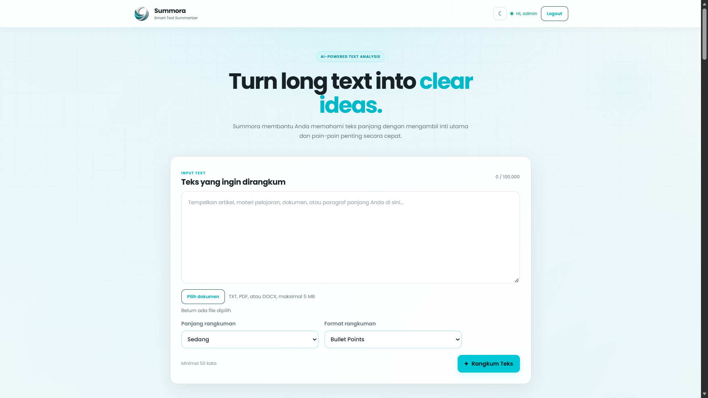
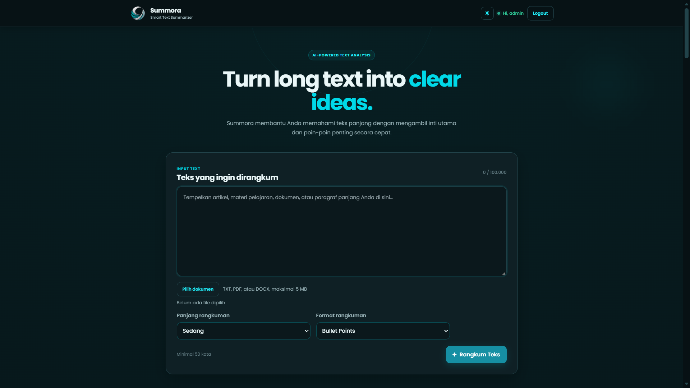

# SUMMORA

> **Summora — AI Text Summarizer**
>
> Aplikasi web untuk merangkum teks secara otomatis menggunakan Artificial Intelligence dengan dukungan autentikasi pengguna, verifikasi email OTP, riwayat rangkuman, dan tampilan Light/Dark Mode.

---

## 📌 Tentang Summora

**Summora** adalah aplikasi web AI yang dirancang untuk membantu pengguna memahami teks panjang dengan lebih cepat melalui rangkuman otomatis.

Pengguna dapat memasukkan teks ke dalam Summora, kemudian sistem akan memproses teks tersebut menggunakan AI dan menghasilkan rangkuman yang lebih ringkas dan mudah dipahami.

Summora juga dilengkapi dengan sistem akun pengguna sehingga setiap pengguna dapat memiliki dan mengakses riwayat rangkumannya sendiri.

---

# ✨ Fitur Utama

## 🤖 AI Text Summarization

Summora menggunakan **OpenRouter API** untuk memproses teks dan menghasilkan rangkuman.

Hasil rangkuman terdiri dari:

- **Main Idea**
- **Summary Points**

Sistem juga memastikan hasil rangkuman menggunakan **Bahasa Indonesia**, meskipun teks yang dimasukkan menggunakan bahasa lain.

### Structured AI Response

Response dari AI divalidasi agar memiliki struktur:

```json
{
  "main_idea": "...",
  "summary_points": [
    "...",
    "..."
  ]
}
```

Summora juga memiliki parser yang menangani beberapa kemungkinan format response AI sehingga hasil rangkuman tidak mudah gagal hanya karena format response model.

---

# 🔐 Authentication

Summora memiliki sistem autentikasi pengguna menggunakan:

- Register
- Login
- Logout
- Session
- PostgreSQL
- Password hashing dengan bcrypt

Password pengguna tidak disimpan dalam bentuk plaintext.

---

# 📧 Email Verification dengan OTP

Summora sekarang memiliki sistem **verifikasi email menggunakan OTP**.

Setelah pengguna melakukan registrasi, sistem akan mengirimkan kode OTP ke email pengguna.

### Sistem OTP

- OTP terdiri dari **6 digit**
- OTP dibuat menggunakan `crypto.randomInt()`
- OTP disimpan dalam database dalam bentuk hash
- OTP berlaku selama **5 menit**
- Maksimal **5 kali percobaan**
- Resend OTP memiliki cooldown **60 detik**
- OTP tidak dikirim kembali melalui response API
- OTP lama akan digantikan ketika pengguna melakukan resend

Email dikirim menggunakan:

**Gmail + Nodemailer**

Akun pengirim:

```text
summora.id@gmail.com
```

Password Gmail utama tidak digunakan secara langsung. Sistem menggunakan **Google App Password**.

---

# 🗄️ Database

Pada tahap awal pengembangan, Summora menggunakan MariaDB/MySQL.

Kemudian database aplikasi dimigrasikan ke:

## PostgreSQL

Database PostgreSQL sekarang digunakan sebagai database utama Summora.

Database menyimpan beberapa tabel utama:

```text
users
summaries
summary_chats
sessions
```

### Users

Menyimpan data pengguna seperti:

- ID
- Nama
- Email
- Password Hash
- Status verifikasi
- Data OTP
- Waktu pembuatan akun

### Summaries

Menyimpan:

- ID rangkuman
- User ID
- Teks asli
- Main Idea
- Summary Points
- Waktu pembuatan

### Summary Chats

Digunakan untuk menyimpan data percakapan yang berhubungan dengan rangkuman.

### Sessions

Digunakan untuk menyimpan session login pengguna.

---

# 🔄 Migrasi Database

Summora sebelumnya menggunakan MariaDB.

Data kemudian berhasil dimigrasikan ke PostgreSQL.

Data yang berhasil dipindahkan:

```text
Users       : 6
Summaries   : 23
```

Migrasi dilakukan tanpa menghilangkan data pengguna dan rangkuman yang sudah ada.

---

# 🌓 Light Mode & Dark Mode

Summora mendukung dua tema:

- ☀️ Light Mode
- 🌙 Dark Mode

Pengguna dapat berpindah tema sesuai kebutuhan.

Desain Dark Mode dibuat tetap mengikuti identitas visual Summora tanpa mengubah struktur utama aplikasi.

---

## 📸 Dokumentasi — Light Mode




## 📸 Dokumentasi — Dark Mode

>

# 🖥️ Dokumentasi Tampilan Web

## 🔑 Halaman Login

Halaman login digunakan oleh pengguna yang sudah memiliki akun Summora.

Fitur:

- Email
- Password
- Login
- Navigasi ke Register
- Tampilan status autentikasi


# 📝 Register

Halaman Register digunakan untuk membuat akun Summora baru.

Pengguna perlu memasukkan informasi akun sebelum melanjutkan ke proses verifikasi email.


# 🔢 Verifikasi OTP

Setelah melakukan registrasi, pengguna akan diarahkan ke proses verifikasi email.

Pengguna memasukkan kode OTP yang dikirimkan ke email mereka.


# 🏠 Halaman Utama

Halaman utama merupakan halaman utama aplikasi Summora.

Pengguna dapat:

- Memasukkan teks
- Melihat jumlah karakter
- Menjalankan proses rangkuman
- Melihat hasil rangkuman
- Menyalin hasil rangkuman
- Melihat riwayat
- Mengakses fitur yang berkaitan dengan rangkuman


# 📚 Riwayat Rangkuman

Summora menyimpan riwayat rangkuman pengguna di database.

Setiap pengguna hanya dapat mengakses rangkuman yang berkaitan dengan akun mereka.

Riwayat menyimpan informasi seperti:

- Teks asli
- Main Idea
- Summary Points
- Waktu rangkuman dibuat

---

# 📋 Copy Summary

Pengguna dapat menyalin hasil rangkuman dengan tombol copy.

Data yang disalin hanya mencakup hasil rangkuman:

```text
Main Idea

Summary Points
```

---

# ⌨️ Keyboard Interaction

Summora mendukung penggunaan keyboard untuk mempercepat proses rangkuman.

Pengguna dapat menggunakan tombol:

```text
Enter
```

untuk menjalankan proses rangkuman sesuai mekanisme yang telah diterapkan pada input teks.

---

# 🔔 Notification System

Summora memiliki sistem notification/toast untuk memberikan feedback kepada pengguna.

Notification digunakan untuk berbagai kondisi seperti:

- Login berhasil
- Login gagal
- Register berhasil
- OTP berhasil dikirim
- OTP berhasil diverifikasi
- OTP salah
- OTP expired
- Rangkuman berhasil dibuat
- Error API
- Logout

---

# 🛡️ Security

Beberapa mekanisme keamanan yang digunakan Summora:

- Password hashing menggunakan bcrypt
- Session authentication
- PostgreSQL
- OTP hashing
- OTP expiration
- OTP attempt limitation
- Resend cooldown
- Environment variables untuk credential
- OpenRouter API key disimpan melalui `.env`
- Gmail App Password disimpan melalui `.env`
- Validasi input
- User-specific summary access

Credential sensitif tidak disimpan langsung di source code.

---

# ⚙️ Teknologi yang Digunakan

## Frontend

- HTML
- CSS
- JavaScript

## Backend

- Node.js
- Express.js

## Database

- PostgreSQL

## AI

- OpenRouter API

## Authentication

- Express Session
- bcrypt

## Email

- Nodemailer
- Gmail SMTP
- Google App Password

---

# 📦 Dependencies Utama

Beberapa dependency utama yang digunakan:

```text
express
pg
bcrypt
express-session
nodemailer
dotenv
```

Dependency lainnya dapat dilihat pada:

```text
package.json
```


# 🚀 Menjalankan Summora

Clone repository:

```bash
git clone <repository-url>
cd summora
```

Install dependency:

```bash
npm install
```

Buat file:

```text
.env
```

Kemudian masukkan konfigurasi environment yang diperlukan.

Pastikan PostgreSQL sudah berjalan.

Setelah itu jalankan:

```bash
node server.js
```

Server akan berjalan pada:

```text
http://localhost:3000
```

---

# ❤️ Health Check

Summora menyediakan endpoint untuk mengecek kondisi server dan database:

```text
GET /api/health
```

Response:

```json
{
  "success": true,
  "message": "Summora API dan database berjalan.",
  "database": "connected"
}
```

---

# 📊 Arsitektur Sederhana

```text
                ┌──────────────────┐
                │      User        │
                └────────┬─────────┘
                         │
                         ▼
                ┌──────────────────┐
                │   Summora Web    │
                │ HTML/CSS/JS      │
                └────────┬─────────┘
                         │
                         ▼
                ┌──────────────────┐
                │   Express.js     │
                │     Backend      │
                └───────┬───┬──────┘
                        │   │
             ┌──────────┘   └──────────┐
             ▼                         ▼
   ┌──────────────────┐      ┌──────────────────┐
   │   PostgreSQL     │      │   OpenRouter AI  │
   │                  │      │                  │
   │ users            │      │ Text Summary     │
   │ summaries        │      │ JSON Response    │
   │ summary_chats    │      └──────────────────┘
   │ sessions         │
   └──────────────────┘
             │
             │
             ▼
   ┌──────────────────┐
   │ Gmail + Nodemailer│
   │                  │
   │ OTP Verification │
   └──────────────────┘
```

---

# 🔄 Alur Registrasi

```text
User
 │
 ▼
Register
 │
 ▼
Data disimpan ke PostgreSQL
 │
 ▼
Generate OTP
 │
 ▼
Hash OTP
 │
 ▼
Kirim OTP melalui Gmail
 │
 ▼
User memasukkan OTP
 │
 ▼
Verifikasi OTP
 │
 ├── Salah → Percobaan dibatasi
 │
 ├── Expired → OTP tidak valid
 │
 └── Benar
       │
       ▼
 Email terverifikasi
       │
       ▼
 Login
```

---

# 🤖 Alur Rangkuman

```text
User memasukkan teks
        │
        ▼
   Validasi input
        │
        ▼
     Express.js
        │
        ▼
    OpenRouter
        │
        ▼
   AI Processing
        │
        ▼
  JSON Validation
        │
        ▼
 Main Idea + Summary Points
        │
        ▼
 PostgreSQL
        │
        ▼
   Tampil ke User
```

---


# 📁 Struktur Project

Struktur utama project:

```text
summora/
│
├── public/
│   ├── index.html
│   ├── script.js
│   └── style.css
│
├── server.js
├── migrate.js
├── package.json
├── package-lock.json
├── .env
├── .gitignore
│
└── docs/
    ├── login.png
    ├── main-light.png
    ├── main-dark.png
    ├── register.png
    └── otp.png
```

> Folder `docs/` dapat digunakan untuk menyimpan screenshot dokumentasi aplikasi.

---

# 📈 Perkembangan Project

## Versi Awal

- Membuat interface Summora.
- Membuat fitur input teks.
- Membuat sistem rangkuman AI.
- Integrasi API AI.

## Pengembangan Backend

- Membuat Express.js backend.
- Membuat sistem authentication.
- Membuat session login.
- Membuat penyimpanan rangkuman.

## Database

- Menggunakan MariaDB pada tahap awal.
- Melakukan migrasi dari MariaDB ke PostgreSQL.
- Memindahkan data users dan summaries.
- Menggunakan PostgreSQL sebagai database utama.

Data setelah migrasi:

```text
Users       : 6
Summaries   : 23
```

## Authentication

- Register
- Login
- Logout
- Session
- Password hashing
- User-specific summaries

## Email Verification

- Integrasi Nodemailer
- Gmail SMTP
- Google App Password
- OTP 6 digit
- OTP hashing
- OTP expiration
- OTP attempt limit
- Resend cooldown

## UI/UX

- Light Mode
- Dark Mode
- Notification Toast
- Modal authentication
- Summary history
- Copy summary
- Keyboard interaction
- Responsive layout
- Perbaikan tampilan authentication

## AI Response

- Integrasi OpenRouter
- Structured JSON response
- JSON validation
- Robust response parser
- Error handling terhadap response AI yang tidak valid
- Output rangkuman Bahasa Indonesia

---

# 🎯 Tujuan Project

Summora dibuat sebagai project pengembangan aplikasi web yang menggabungkan:

- Web Development
- Backend Development
- Database Management
- Artificial Intelligence
- Authentication
- Email Verification
- API Integration
- Security
- UI/UX

Project ini juga menjadi media pembelajaran untuk memahami bagaimana frontend, backend, database, AI API, authentication, dan email service dapat diintegrasikan dalam satu aplikasi web.

---

# 👨‍💻 Developer

**Wynand Mario Petta**


### Interest

- Web Development
- Server & Networking
- Cyber Security
- Database
- Artificial Intelligence

---

# 📜 License

Project ini dibuat untuk keperluan pembelajaran dan pengembangan.

© 2026 Summora

